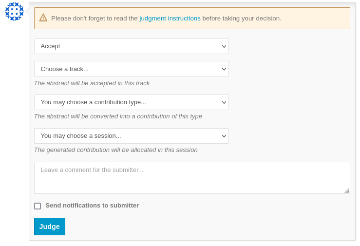

# Accepting proposals for contributed oral presentations by MC Coordinators during SPC/3

---

*This is an explanation for the Main Classification Coordinators (MCC) on how to perform the **fifth steps of the [Simplified workflow for selection of Contributed Abstracts](intro.md#simplified-workflow)**..*

---

Before the SPC/3 meeting the MC Coordinators will work on the abstracts reviewed by the SPC, usually starting from an [export prepared by the Scientific Secretariat](../../InvitedOrals/SStipsandtricks/#1-get-a-spreadsheet-summary-of-reviews). Every coordinator will propose a set of abstracts, together with a number of backups, to the SPC/3 for final discussion and approval. 

During SPC/3 the SPC will discuss all the proposals and eventually accept those that will actually be invited to submit a contributed oral.

Every MC Coordinator will act in their assigned Track and work through all of the proposals to be accepted, then "judging" them, i.e. accepting them as invited orals, in the correct track. 

After clicking on an abstract title, at the bottom the *judging area* will appear:

---

*MC Coordinators should carefully read the judgement instructions available before judging. Special requirements may be present for any specific IPAC.*

---

Similarly as before, there are four options for the judgement:

- **Accept** 

- *Reject*

- *Mark as duplicate*

- *Merge*

*Only use the first option, Accept* should be selected, when the SPC agrees on this abstract to become a contributed oral presentation. All the other abstracts can be left without any judgement by now. After the list of contributed oral presentations will be confirmed, the Scientific Secretariat will accept them as Poster Presentations.

Please also check that the **right track** is selected and that the contribution type is "**Oral Presentation**"

We also recommend to **deselect the "*Send notifications to submitter*"** checkbox - otherwise an email will be sent to the abstract submitter - invitations should be sent later on by the Scientific Secretariat.

---

Alternatively, this job can be left to the Scientific Secretariat altogether. They can work through the accepted abstracts via the Management Area and "judge" on behalf of the MC Coordinators.

---
