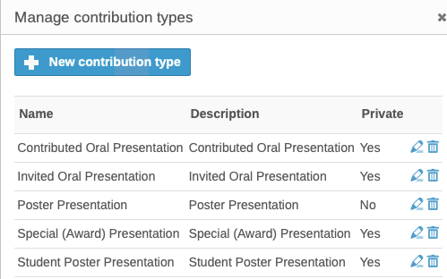
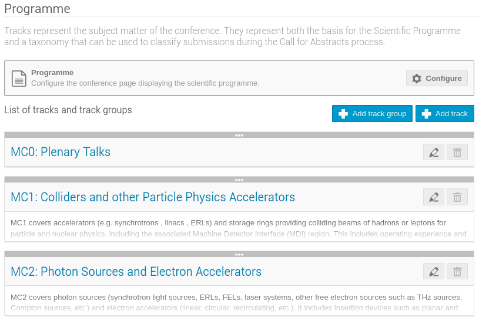
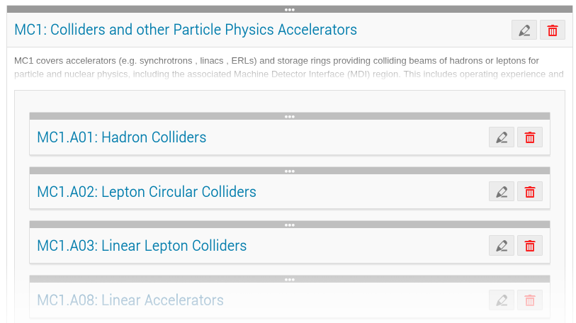
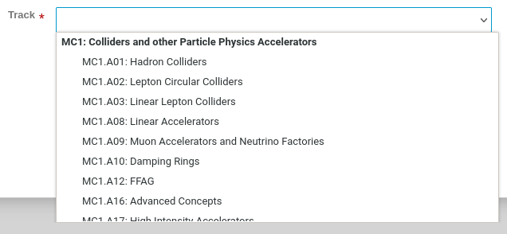
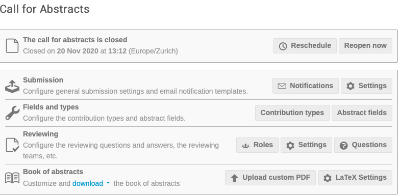
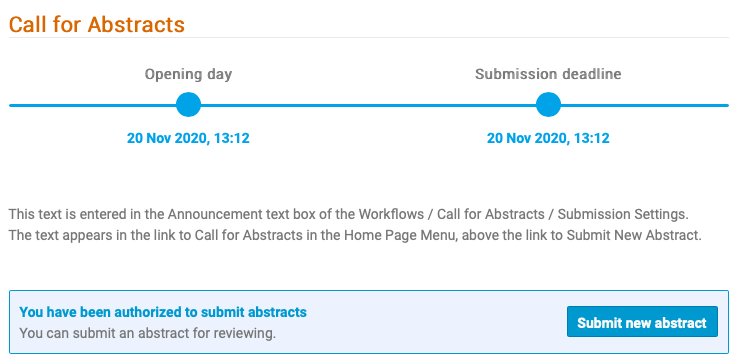
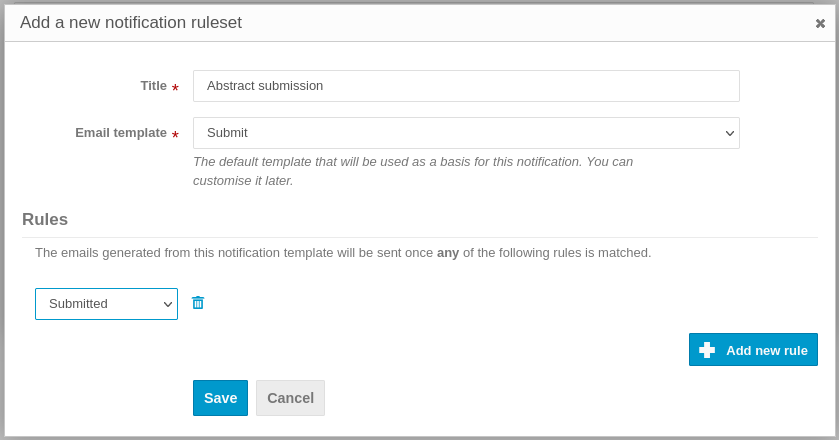
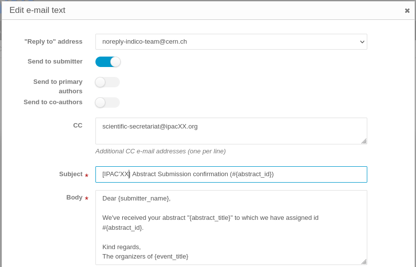

# Setting up by the Scientific Secretary/Admin/Editor-in-Chief for the submission of contributed abstracts

In the first phase of setting up [Invited Presentations in the Programme](../InvitedOrals/intro) we were able to create the first part of the programme. What is missing is contributed oral presentations and contributed posters. The abstract proposals for these two kind of presentations will be submitted by their authors during the general abstract submission interval.

Some changes in the Indico setup are needed before starting this important part of the conference organisation.

Again, before letting anybody submitting abstracts, please check that [manual entry of authors/speakers is disallowed](/InitialSetup/mgmt_area_02/#participant-roles). This way, authors will be forced to only use profiles from the JACoW Central Repository when submitting or editing abstracts or contributions.

## 1. Removal of all the abstract proposals for invited orals

Before opening the general abstract submission and contemporary access to existing contributions by invited authors it is necessary to remove all the abstracts (not the contributions!). If not, any proposed author for invited orals will be able to see who proposed their abstracts and get evidence of their acceptance or not, which won't be nice. 

This operation is also described in the [final Admin steps for the Invited Oral proposals](../InvitedOrals/SSinviteinvited.md#cleaning-up-to-remove-proposals).

## 2. Changing visibility of Contribution types

During the [Setup for proposals of invited presentations](../InvitedOrals/SSsetup/#organization-contributions-settings) all presentation types were created. Only *Invited Oral Presentation* where made visible to the public which, at that time, was made of SAB/OC/SPC members. Now we have to switch off visibility for special presentations and only allow Contributed ones to be choosable. 

Start by accessing the Contributions panel,  then open the Settings menu and click on "*Contribution types*":

Now, edit all contribution types **ensuring that all except *Contributed Oral Presentation* and *Poster Presentation* are Private**:

## 3. Introducing Sub-Classifications

The system is already setup with all the Main Classifications (MC) as tracks:

For the contributed abstracts submission it is necessary to further define all tracks by introducing Sub-Classifications (MC). This will be done by **reworking the existing tracks as track groups**, then introducing the new (detailed) **sub-classifications as tracks**. The combination of Track Groups and Tracks (Main and Sub-classifications) makes it far easier for submitters to decide the precise place their contribution should appear in the programme, and for the Event Administrator to schedule them.

The **Organisation / Programme** section of Indico allows the entry of Track Groups and Tracks: 

Start by creating track groups for any Main Classification, then tracks for any Sub-Classification, like the following example (it is very useful to start all tracks by repeating the MC and SC, like `MC1.A01:`):

This setup will result in a neater popup menu when submitting abstracts: 

## 4. Configuring abstract submission

Small changes are also required in *Workflows / Call for Abstracts*.

### Submission / Settings

#### Announcement

Enter here a statement concerning abstract submission that will be visible by accessing the *Call for Abstracts* menu item in the Home Page Menu, above the *Submit New Abstract* button:

#### Instructions

The instructions here will be displayed above the abstract submission form. It should be used for precise instructions, for example concerning the Footnotes field or any special instructions peculiar to this IPAC edition. Reference to the [general submission instructions](../submission) may be useful to also have here. 

---

All remaining controls should be left unchanged from the previous exercise related to invited oral proposals.

## 5. Setup email notifications to submitters

It will be nice for the submitters to receive an email confirming reception of their abstracts. Indico can do this by way of the Notificatons tool available at *Workflows / Call for Abstracts / Submission / Notifications*.

Start adding a new notification by way of the "**Add new one**" button:

Give a name to this new ruleset (visible only to admins in Indico) and choose the "**Submit**" email template.

Press the button "**Add new rule**" and choose "**Submitted**" from the popup menu. The result should be similar to this image:

Now you can setup the details of the email. Placeholders can be uses (e.g. `{abstract_id}`, `{submitter_name}`, etc.) Refer to the legenda below the Body of the email.

We recommend that only submitters are notified (not the other authors), so be sure to deselect "Send to primary authors" and "Send to co-authors".

It may be useful for the scientific secretariat to receive copy of these emails to monitor the submission activity. For this purpose, enter their email address in the "CC" field.

## 6. Change of event access mode/rights

To let people to access the Indico event, go to *Protection* and change the *Protection mode* to *Inheriting* (or *Public*, which should be inherited from the IPAC category).

## 7. Opening abstract submission

When you're ready to open abstract submission, go back to [Submission / Settings](#submission-settings) and either schedule it or open it explicitely.
