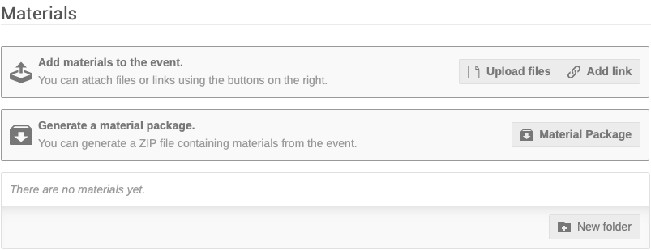
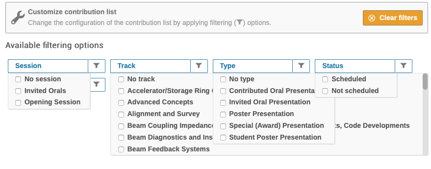

# Management Area

## Organization

### Materials

The above gives the possibility of making any material
downloadable from the event's homepage, i.e. logo,
programme booklet, poster, etc.

### Contributions

Contributions to the conference are created and managed
via this screen. As mentioned above, contributions are
presentations that have been accepted for presentation.
Via "Settings" create contribution types, contribution
duration and custom fields. Click on +New Contribution
to create a contribution – this is NOT a proposal, but an
accepted contribution.

All conference contributions are visible in this screen.
The Filter option offers the possibility to organize
contributions by session, track, type, etc.

Also in this screen is the link to Settings / Custom fields and Manage Custom Fields

Custom fields might be Footnotes, Keywords, etc.

### Participant Roles

The persons entered in the Roles Setup screen appear in this screen with their roles and the possibility to customise privileges. Use "Filter Role" to search on persons with roles.

Please note that some roles are built-in in Indico and are *not* definable in the "Roles Setup", like:

- Author (AUT)

- Speaker (SPK)

- Chairpersons

- Conveners

### Programme

In Indico, *Tracks represent the subject matter of the
conference. They represent both the basis for the
Scientific Programme and a taxonomy that can be used to
classify submissions during the Call for Abstracts
process.*

Many JACoW accelerator conferences have adopted a
combination of **Main** plus **Sub-classifications** to enable a
finer tuning of content, facilitating the scheduling of
posters across numerous sessions and days. For example,
the Sub-classification/Track "novel concepts" may at an
Accelerator conference be tied to several different Main
Classifications/Track Groups, i.e. novel concepts in
Circular Colliders, novel concepts in Light Sources.
The SPMS functionality allowed for the submitting author
to first select a Main Classification, which opened up a
sub-list of Sub-classifications.
In JACoW-Indico the Programme screen is used to enter
Track Groups with the associated Tracks, but upon
abstract submission it is not possible to separate the Track
Groups, all Track Groups and all Tracks are therefore
visible to authors. 

The Track Groups and Tracks entered in this screen
appear in the Display View of the Scientific Programme.

### Registration

This screen customizes the registration procedure.
Registration managers and staff with corresponding
privileges are entered, the participant list is defined and
registration forms are created.

### Reminders

Via this screen it is possible to setup "Reminders", which
are e-mails set up to be delivered relative to the event start
time, at a fixed date/time, immediately. They are sent
either to Participants/registrants at the event, or to
individual e-mail addresses, to be entered one at a time.

The Sender may be chosen from the Event Administrators
whose name will appear as the Sender. It is possible to
add a custom message to be included in the e-mail. It is
also possible to include the agenda (a simple text version
of the event) and a description of the event.

### Roles Setup

Conference Organizer roles are entered in this screen, as
well as the names of the persons in the roles. This
information appears in the Participant Roles screen
mentioned above under item 3. Each role is given a title, a
code, and if desired a colour code.

A non-exhaustive list of Roles would include the
committee members of OC/SPC/LOC, Scientific
Advisory Board, Scientific Secretary, Editor-in-Chief,
Editor, IT Manager, Industrial Exhibition Manager... 
It is possible to send e-mails to these roles. It is also
possible to export/import members of one role to quickly define new roles in this (or other) events.

### Sessions

Sessions are entered in this screen. It is possible to
configure *session types* via the Settings link. More information on how to manage sessions is available elsewhere in this manual.

### Surveys

This feature allows the creation of questionnaires for the event and collect people's answers. It is *not* needed to be logged in Indico to fill in the serveys.
