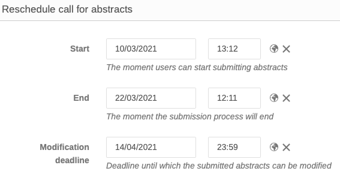

# Management Area

## Workflows

This chapter has been designed specifically for JACoW-
Indico events. It deals with the Call for Abstracts, Peer
Reviewing and the Editorial Module.

### Workflows / Call for Abstracts

This area links to several screens used to

1. schedule abstract submission
2. configure general submission settings and e-mail
   notification templates
3. configure contribution types and abstract fields
4. configure the reviewing questions and answers, the reviewing teams, etc.
5. customize and download the book of abstracts.

#### 1. Schedule Abstract Submission

Clicking on the top option allows the setting of dates of
opening and closure of abstract submission, the deadline
whereby modifications are possible, and re-scheduling of
abstract submission:

Click on "()Re)schedule" opens the screen:

This will be used for **contributed** abstracts only. For **invited** please refer to the [dedicated section in the manual](../InvitedOrals/SScall.md).

#### 2. Configure General Submission Settings and e-mail Notification Templates

This screen is used to configure general abstract submission settings and e-mail notification templates.

##### Settings

###### Announcement

The text entered in the Announcement field appears in the link to Call for Abstracts in the Home Page menu above the link to Submit New Abstract. The Announcement could contain precise instructions on abstract submission.

###### Multiple tracks

If enabled, when submitting it's possible to select multiple tracks. Otherwise, only one track maximum is selectable.

***For IPAC we recommend to disable this setting.***

###### Require tracks

Whether or not the submitter needs to specify tracks. 

***For IPAC we recommend to enable this setting.***

###### Require contrib. type

Whether or not the submitter needs to specify a contribution type for the abstract.

***For IPAC we recommend to enable this setting.***

###### Allow attachments

Allow/do not allow attachments for abstracts.

***For IPAC we recommend to disable this setting.***

###### Allow speakers

This allows/does not allow the selection of the speakers.

***For IPAC we recommend to enable this setting.***

###### Require a speaker

This makes the selection of at least one author as speaker
mandatory.

***For IPAC we recommend to enable this setting.***

###### Allow editing

Editing of abstracts is offered to the four options:

***For IPAC we recommend to select "Abstract submitter only".***

###### Contribution submitters

This screen ensures who will get contribution submission
rights once an abstract has been accepted for presentation:

***For IPAC we recommend to select "Speakers and authors".***

###### Authorized submitters

The entry of "authorized submitters" enables users to always submit abstracts, even outside the regular submission period. This will come handy when [accepting Proposals for Invited Orals](../InvitedOrals/intro.md) or for late submitters.

###### Instructions

Text entered in this field appears in the Instructions text
box in Submission settings. The text could be for
example: *Please submit proposals for a contribution using the Abstracts form. Please enter a title, its abstract and authors/speakers, chosen by using the search
function.*

#### Configure the Contribution Types and Abstracts Fields

##### Contribution types

This screen is used to enter contribution types, for  example invited oral presentation, poster presentation, special award presentation, etc:

##### Abstract fields

This screen allows the creation of additional fields like, for example, Footnotes.

Custom fields could also be "invisible" to the submitters - useful, for example, for the [Abstracts QA]().

#### Reviewing

This screen sets permissions to access/review either all Tracks in the event, or individual Tracks. More information in the [Workflow for the Invited Oral Presentations](../InvitedOrals/intro.md)

#### Book of abstracts

This area is to customize and download the book of abstracts.

#### List of abstracts

This area is designed to view and perform actions on submitted
abstracts. 

### Workflows / Peer Reviewing

Paper Peer Reviewing provides an integrated paper
management and peer reviewing module that allows the
Manager to set up a full paper submission and peer
reviewing workflow.

The link leads to a screen with numerous links out for:
Content reviewing, Layout reviewing, Paper judging,
Paper templates, Reviewing settings, Reviewing teams
and Paper assignment. These activities are described in
the next section on Scientific Programme Management.

#### Editing

This functionality aims to introduce the editorial
module for editors to edit papers prior to publication.
Please note the "Custom editing workflow". This is used
to customize the workflow (like JACoW's workflows). It
is described more fully in the coming chapters.
