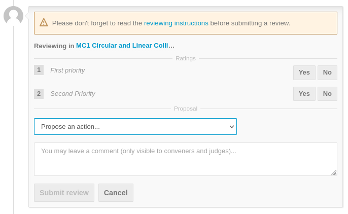

# Assigning priorities to proposals by SPC

---

*This is an explanation for the Scientific Programme Committee (SPC) on how to perform the **fourth step of the [workflow for the Submission of Proposals for Invited Oral Presentations](intro.md#normal-ipac-workflow)**.*

---

Logging in SPC members will be able to return to the "*Call for Abstracts > Review*" interface that was already used for [proposing Track changes](SPCtrackreview.md).

It is now necessary to review the abstract again, this time to assign a priority to those abstracts that are meant to be valid invited orals. The SPC Chair, via the Scientific Secretary, will give precise instructions on how many priorities an SPC member is allowed to assign.

To perform the actual review it is necessary to open an abstract and then click on the *Review button*. 
**Note**: if a change of track was already proposed for this abstract, a *Change Review* button will be present in place of the previous *Review* one. 

For a normal IPAC it is possible to assign a *First Priority* or a *Second Priority* to an abstract, by way of a Yes/No widget: 

Again, the maximum number of first and second priorities is decided by the SPC chair.

After scoring a First or Second Priority, an action must be selected from the pop-up menu:

- **Accept** means a suggestion for the SPC to accept this proposal: *this should be the normal option at this stage*

- **Reject**, similarly, suggests not to accept this proposal. For IPAC this *should NOT be used* unless for very special cases

- **Change track** was already done in the [previous steps](SPCtrackreview.md) and *should NOT be selected now*

- **Mark as duplicate** also is a *special case and rarely used*, only if and when the reviewer thinks the proposal is an exact duplicate of another. The exact abstract ID and title are to be entered by way of the popup menu

- **Merge** is a request to merge this proposal with another. *This should not be used*

Since all abstracts should now be in the correct Tracks, SPC members should now go to the Track of their interest and enter their priorities with an *Accept* review. **They should NOT Review/Enter priorities if the abstract is of no interest.**

To complete this task please remember to click on the **Submit review** button.

---

*SPC members should carefully read the reviewing instructions available after pressing the "Review" button before posting their review. Special requirements may be present for each specific IPAC.*

---
