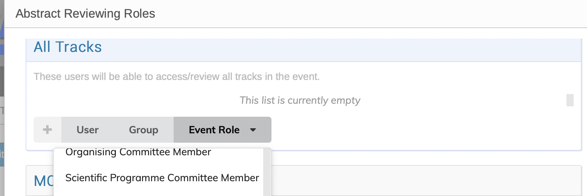
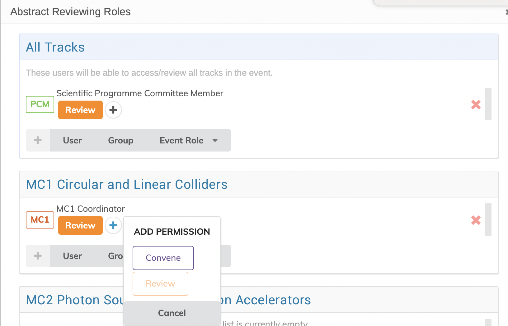
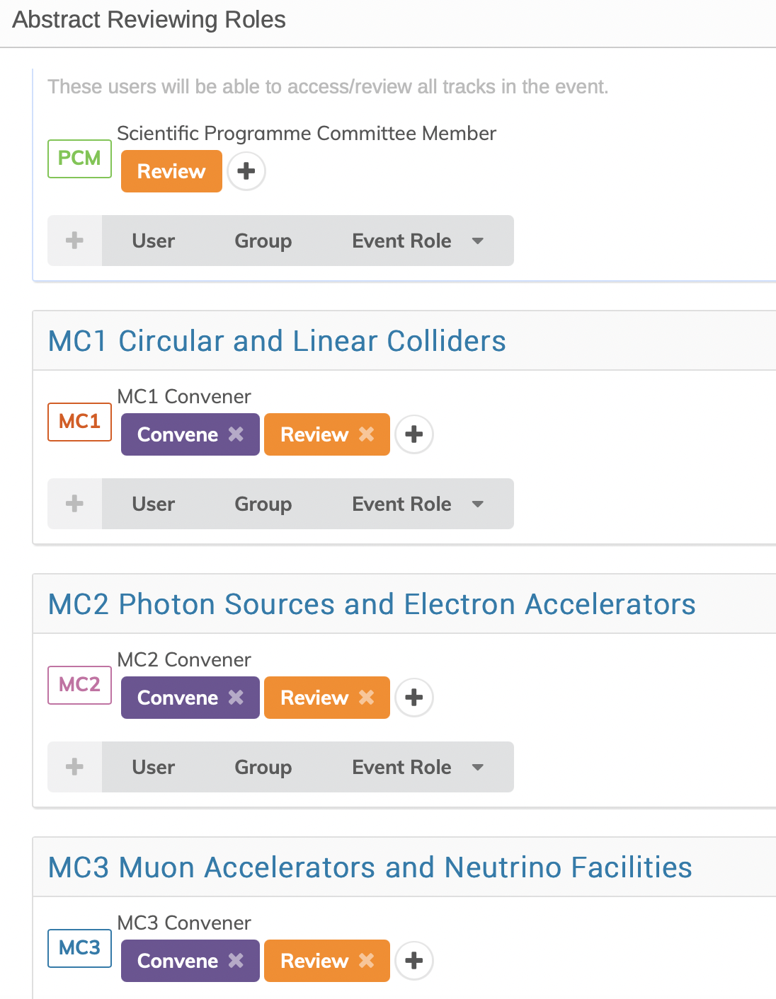
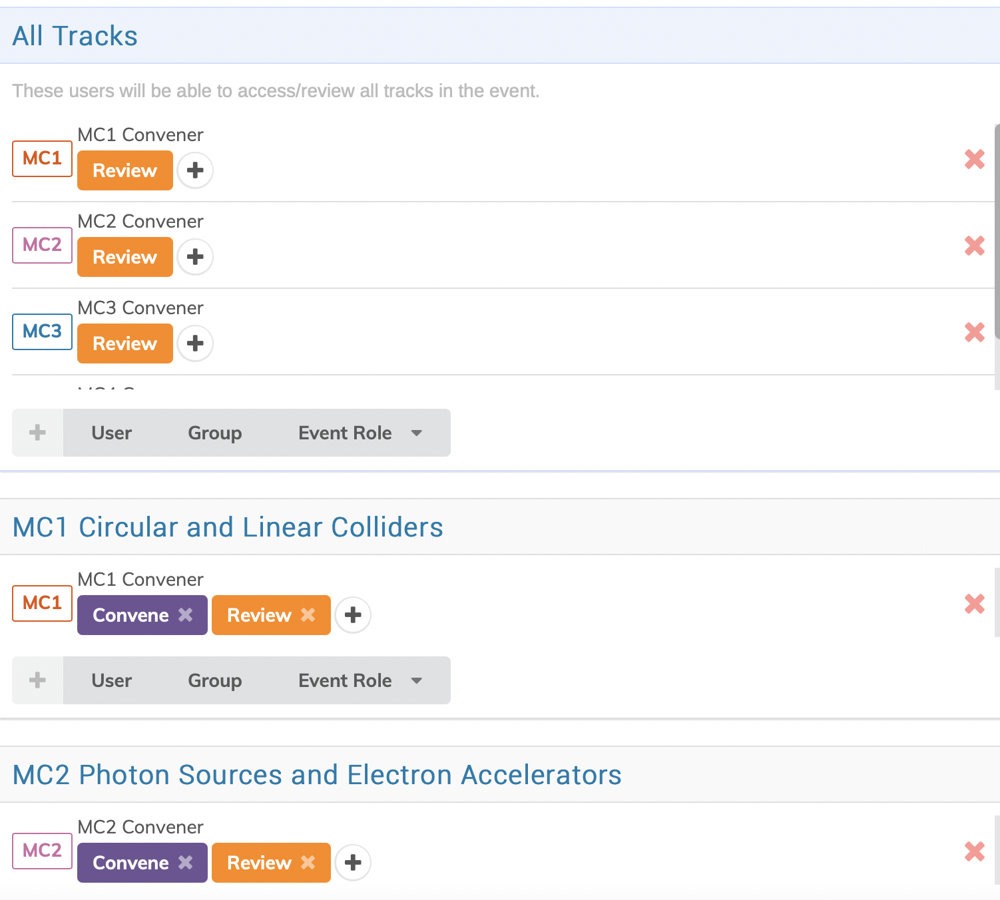
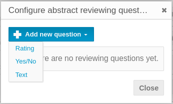
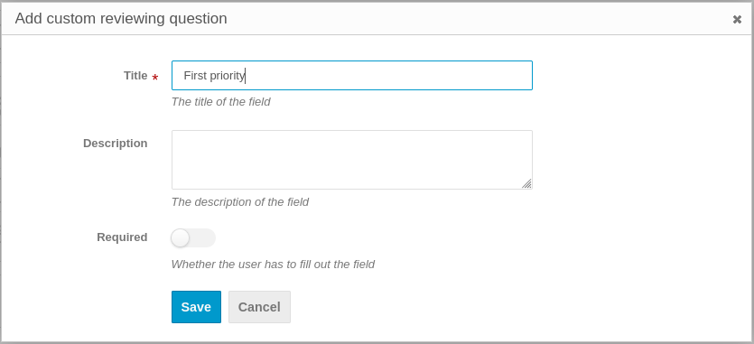

# Setting up for the SPC reviewal process

---

*These are the instructions for the Scientific Secretariat/Admin about how to setup Indico for the **second and following steps of the [workflow for the Submission of Proposals for Invited Oral Presentations](intro.md#normal-ipac-workflow)**.*

---

## Overview of the process

As soon as the [Abstract Initial QA](SSinitialQA.md) is complete the Administrator sets up for the SPC to:

a) Verify all Tracks are correct/Propose Track changes

b) Accept/reject proposals for Track changes

c) Prioritize invited oral proposals

d) Accept/Reject proposals for invited orals

The setting up for the above will necessarily be in **several distinct steps** with careful attention to permissions and deadlines:

1. because in order for **all** SPC members to see **all** proposals (both for Tracks and Prioritization) they must **all** have *Review privilege* on **all** abstracts submitted. MC Coordinators will have *Convene permissions* which include the possibility to actually change the Track for the abstracts. SPC members must therefore be warned to limit themselves to proposing Track changes and comments;
2. because currently the two activities, a) and c) are grouped in the same screen and it would be possible for SPC members to return to Track changes when that exercise is normally closed.

The process we will follow is:

1. **All SPC members** are given *Review permission* on all Tracks, with a deadline to verify the tracks are correct and to propose changes where necessary. After the deadline this permission is revoked so no other changes will be possible during the following step.

2. **MC Coordinators** (*Track Conveners*) are assigned *Convene permissions* in their designated Tracks and are invited to "edit" the proposals for Track changes and eventually change track for the given abstract.

3. The **Administrator** then prepares the Prioritization as described further on.

4. **All SPC members** are again given **Review** privilege to prioritize **proposals** for invited orals.

5. During the SPC/2 meeting, and following discussion, **Conveners** are assigned **Judging permissions** to accept/reject proposals for invited orals, which then automatically become contributions which can be scheduled.

## 1. Assign *Review* permission to the SPC

Assigning the privileges/permissions to SPC members and Conveners for the above tasks is done via the *Workflows > Call for Abstracts > Reviewing* screen which controls the roles with permissions to review, the settings, and questions:

For IPAC, the SPC is normally divided into small working groups composed of a Track Group Coordinator per Track Group (Main Classification) from the hosting region, and a Co-Coordinator from one of the other regions. In some instances, extra persons are added. 

Prior therefore to assigning permissions, the Roles of *SPC Member*, and *Track Group Coordinator/Convener/Judge* and the relevant persons for each of the Tracks need to be set up in the *Organization / Roles* setup screen. The Coordinators/Conveners might be called **MC1 Convener**, **MC2 Convener**, **MC3 Convener** etc. for example. Behind each Role, the names of the persons should have been entered:

To set permissions, go to *Workflows > Call for Abstracts > Reviewing > Roles*. At the top of the page, under **All Tracks**, click on Event Role and enter the role of SPC Member:

Once the role of SPC Members has been entered, the screen shows this:

Then for each Track enter the role of the corresponding Coordinator/Convener, and click on the "**+**" to the right to add **Convene**:

When all Conveners have been entered the screen looks like this:

### General settings

It also is necessary to check the *Workflows > Call for Abstracts > Reviewing > Settings*, in particular:

- **Allow track conveners to judge**: for this exercise it should be **disabled**;

- **Allow conveners to change tracks**: for this exercise it should be **disabled**;

- **Allow comments**: for this exercise it should be **enabled**;

- **Allow contributors in comments**: for this exercise it should be **disabled**;

- **Reviewing Instructions**: put here a summary of the instructions the SPC will go through.

### Notes on permissions

With the above setup the SPC members will be able to only read comments left with visibility set "*To reviewers, conveners and judges*". If you want that these people will also be able to read comments left with visibility set "*To conveners and judges*", plus all the reviews left so far (i.e., proposals for track changes only, per instructions), then it will be needed to give "*Convene*" permissions to SPC as well. In this case, be sure that the settings "*Allow track conveners to judge*" and "*Allow conveners to change tracks*" are **NOT** set in the *Workflow / Call for Abstracts / Settings* pane.

### Call for the SPC review

Now it's the time to inform the SPC members about what they're asked to do and how.

The Scientific Secretariat will go to the *Roles Setup* or *Participant Roles* screens and send an email to the SPC in a similar way of that of the [Call for Proposals for Invited Oral Presentations](SScall.md). We suggest that this email includes a link to the [detailed instructions for this particular job of the SPC](SPCtrackreview.md). This activity should last **one/two weeks**, a deadline needs to be given accordingly.

## 2. MC Coordinators review Track changes proposals

First action to do after the deadline for submission of proposals for invited oral presentations is to remove *Review* permissions to the SPC. This way the MC conveners will be able to work through the next phase without fear of having new reviews coming in. To do so, refer to the [instructions above](#1-assign-review-permission-to-the-spc) and click on the "**X**" sign in the *Review orange button* for the Scientific Programme Committee member. After this action the MC Coordinators will still have Convener permissions on their assigned MC/Track - it may be wise to also give them *Review permissions on all tracks* so that they can access all abstracts.

Next, go to *Workflows > Call for Abstracts > Reviewing > Settings* and enable the "**Allow conveners to change tracks**". Remember to save the change.

### Call for the MC Coordinators review

As usal, it's time now to notify the MC Coordinators to review the track changes requests. With the email utility of your choice in the *Roles Setup* or *Participant Roles* screens, the Scientific Secretariat will send [instructions](MCCtrackreview.md) to the Track Conveners, together with a clear deadline. This exercise should last **one/two weeks**.

## 3. Preparation for the Prioritization of proposed abstracts

The next task is to reconfigure the abstract reviewing interface via the *Workflows > Call for Abstracts > Settings* pane:

 Work through the various issues:

- **Scale from/to**: Enter here the scale to weight the value of proposals, for example from 1 to 3 to be used for the invited oral selection – we are proposing:
  
    - **3** = top priority/highest ranking
  
    - **2** = second priority
  
    - **1** = lowest priority/lowest ranking

Note that the *Questions* interface should only be completed when the prioritization begins. It is better to enable this second activity only after the Track change proposals are complete.

- **Allow track conveners to judge**: keep this *disabled* until the next step in the workflow

- **Allow conveners to change tracks**: *disable* this to avoid MC Coordinators to make any changes that should have already been performed in the previous step - you can enable it at any time upon special requests

- **Reviewing Instructions**: you may want to modify the text to now give the SPC detailed instructions about the scores to be given to the proposals

- **Judgment Instructions**: put here the instructions for the MC Coordinators on how to accept (or not) the proposals and turn them into contributions

To be able to enter a priority for consideration of invited oral presentations, it is necessary to configure abstract reviewing **questions** via the **Workflows > Call for Abstracts > Reviewing > Questions** interface:

For this exercise we are adding a question of type ***Rating***:

## 4. Set Review privilege to all SPC members

Similarly to what done in the [first step of this process](#1-assign-review-permission-to-the-spc), the SPC members need to have assigned *Review privilege* again.

MC Coordinators (Conveners) should still have *Convene privilege* from the start, which won't change.

### Call for the prioritization exercise

With the above in place, a mail may be sent to the SPC providing [instructions](SPCprioritization.md) which should guide members through this tasks with appropriate warnings, together with a clear deadline. This exercise should last **two/three weeks**.

## 5. Accept/Reject proposals by MC Coordinators during SPC/2

When the prioritization exercise is over it is necessary to **give *Judgement* power to the MC Coordinators** (*Conveners*). This can be done by getting back to the *Workflows > Call for Abstracts > Settings* pane and **enabling the Allow track conveners to judge** setting.

This will enable MC Coordinators to actually accept the wanted proposals. It may be convenient to prepare statistics on the scoring gave to the abstracts, prepare an export of the abstracts into XL etc. The MC Coordinators should come to the SPC/2 with a detailed proposal.

---

**Note**: these workflow put the responsibility of finally accepting abstracts and turn them into contributions to the MC Coordinators, which need to be well educated about the tool. It may be safer **NOT to assign judging permissions to Coordinators/**Conveners and **leave this to the Scientific Secretariat**.

---
