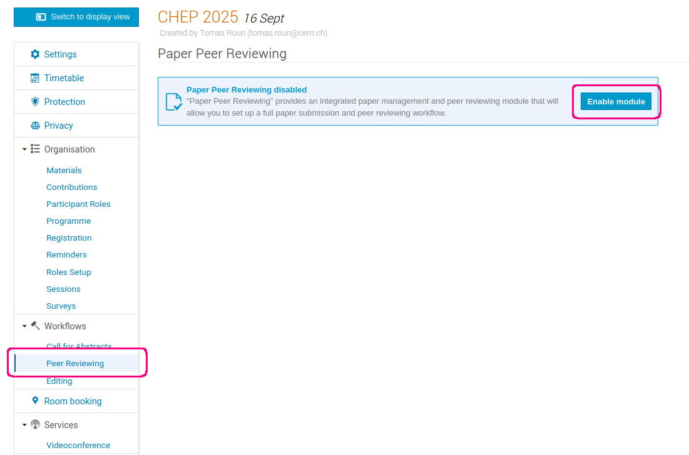
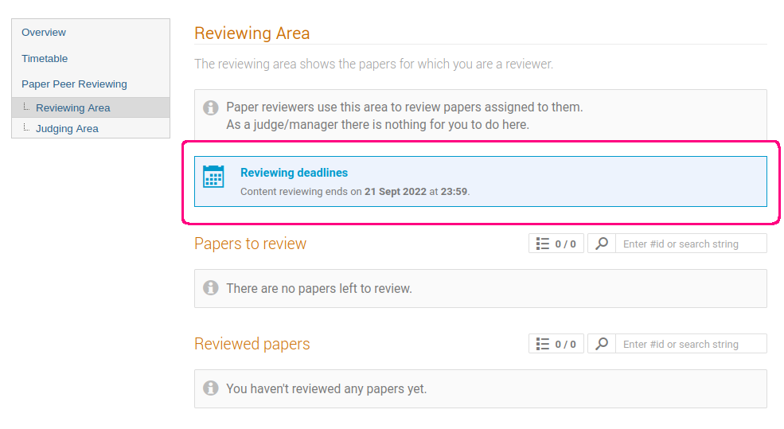
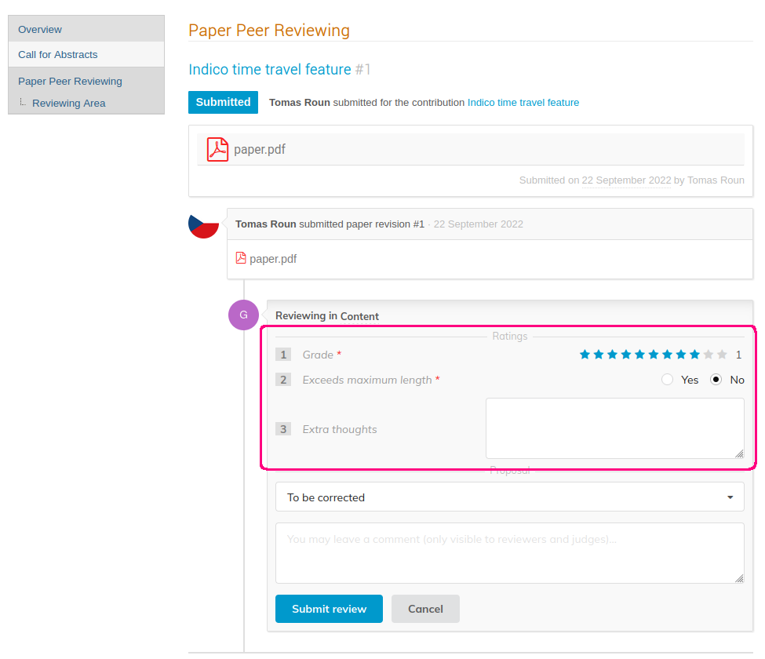
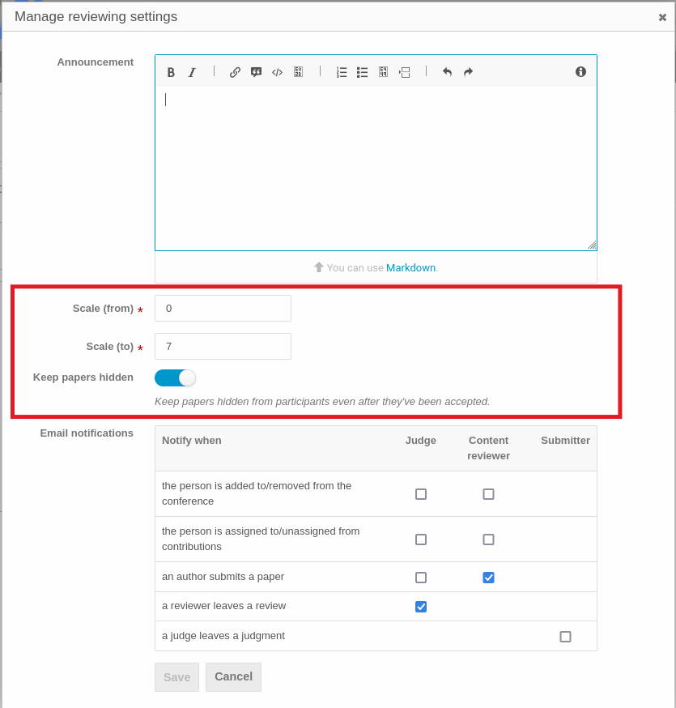
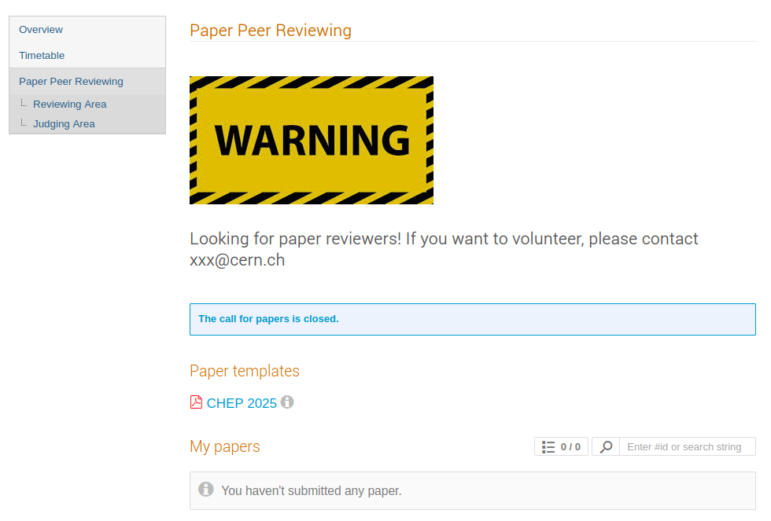
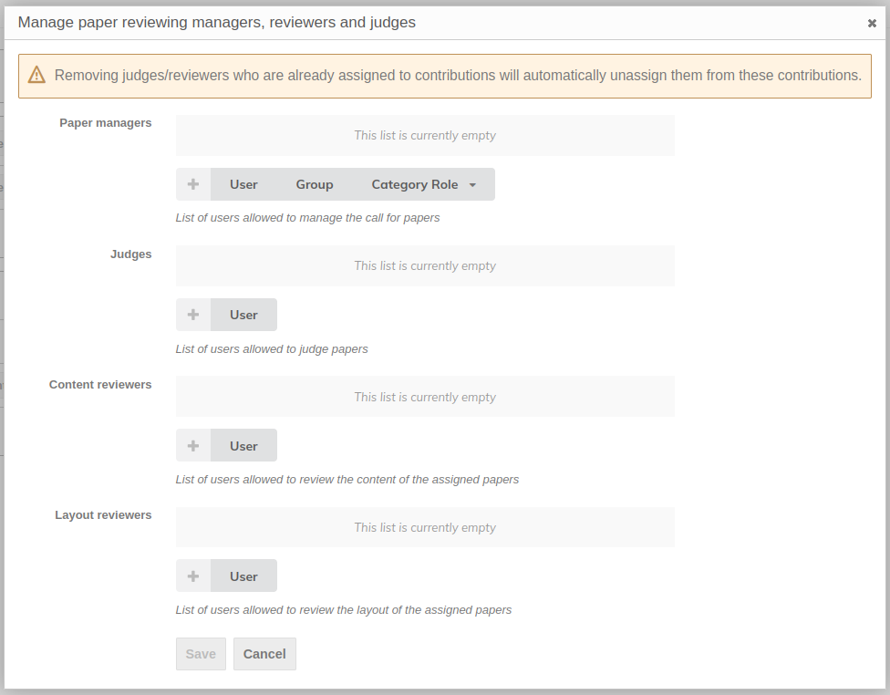
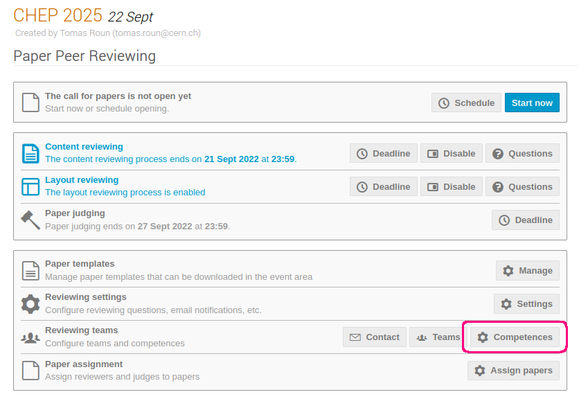
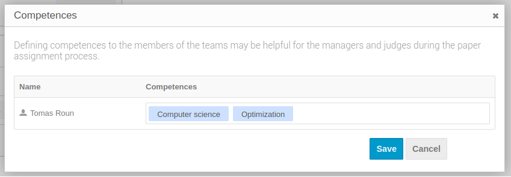
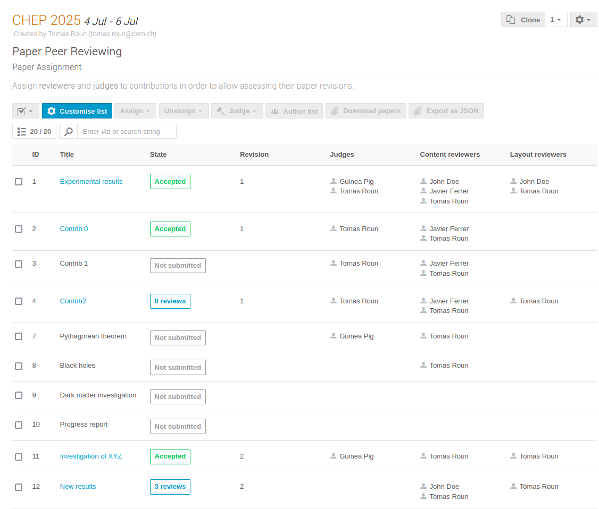

# Setting up the LPR module as Scientific Secretariat/Admin

## Enabling the module

In order to start using the Peer Reviewing module, you need to first enable it.
From the event management page, click on the _Peer Reviewing_ tab in the left menu, under _Workflows_.

Finally, Click _Enable module_ to enable the Peer Reviewing module.

The module can be disabled at any time from the _Features_ tab under _Advanced options_.

Once the module is enabled, you will see new tabs appear in the conference's menu when switching to the display area.

Please note that only the first level menu "*Paper Peer Reviewing*" will be visible to the submitting authors. The sub-menus "*Reviewing Area*" and "*Judging Area*" will be visible to reviewers and judges respectably.

## Uploading template files (optional)

If your conference requires papers to have a specific style or layout, you can help paper authors by uploading a paper template.

Authors will then be able to download this template from the _Paper Peer Reviewing_ tab of the conference.

To upload a template, select the _Peer Reviewing_ tab in the management area. Then, click on _Manage_ next to _Paper templates_.

Here, you can upload your template, give it a name and optionally a description. You can also upload more than one template if you wish.

The template becomes visible in the display area of the conference:

#### Setting up content reviewing

The peer reviewing module allows reviewers to review the content and the layout of a paper separately.

**IPAC only deals with content review: the layout will be managed by the JACoW Proceedings Office by using the Editing module of Indico.**

By default, only the content reviewing process is enabled in the *Paper Peer Reviewing* tab. You can leave this setting as it is.

In addition, it is possible to set a **reviewing deadline** for both content reviewing. If a deadline is set, an information box will appear in the reviewing area informing reviewers about the deadline. The deadline can also be enforced, which will also prevent reviewing after the specified date.

To set a reviewing deadline, click on the _Deadline_ button next to the reviewing process for which you want to set the deadline:

This is what reviewers see when the deadline is set:

Reviewers can also be presented with custom questions when leaving a review on a paper.

This can be useful when extra information besides accepting/rejecting a paper is needed from a reviewer.

There are the three types of questions that can be used:

- A rating

- A yes/no question

- A free text

Each question has a name, description and additional settings depending on the question type. Each question can also be configured as required meaning, the reviewer is required to answer the question before leaving a review.

You can add reviewing questions by clicking the _Questions_ button next to the corresponding reviewing process.

This is what the various questions look like from a reviewer's point of view:

The scale of the rating questions (the minimum and maximum value) is the same for every question and can be configured in the reviewing settings:

---

**Note**: changing the minimum and maximum value of the ratings will scale all the existing answers proportionally.

---

Please be also sure to **set the** "**Keep papers hidden**" flag in the settings, as shown in the picture above. If not, all accepted papers will be downloadable by anybody from their contribution page. We don't want this to happen, since the papers must still go through the editing process and eventually be published in the final proceedings.

## Setting up paper judging

The only setting available specifically for judges is the judging deadline, which works the same way as the reviewing deadlines explained previously.

Once the deadline is set, an information box will appear in the judging area of the conference. If the deadline is enforced, judges won't be able to judge papers after the deadline.

## Reviewing settings

The reviewing settings let you configure an announcement, set the scale for rating questions (explained in previous sections) and manage email notifications.

The announcement can be used to display a message on the peer reviewing page for reviewers to see.

Email notifications lets you configure who and under which circumstances  should receive an email — for example, whether you want a judge to be notified when a paper is reviewed. The most common notifications are turned on by default, but you can fine tune them as you need. We will cover how to designate reviewers and judges and how to assign them to papers in the following sections.

To open the reviewing settings, click on the _Settings_ button next to _Reviewing settings_.

Here is a screenshot of what an announcement may look like.
The announcement editor supports basic styles via Markdown. You can also embed images using a link.

## Setting up reviewing teams

Before you can assign papers to reviewers and judges, it is necessary to set up reviewing teams.

These designate who has the right to review and/or judge a paper.

To get started, click on the _Teams_ button next to _Reviewing teams_.

From the dialog window, you can add paper (LPR) managers, judges and reviewers. 

Paper managers have rights to manage the settings of the Peer Reviewing module.

You can also manage paper managers from the _Protection_ tab of the event by adding the _Paper manager_ permission.

Once the teams are set up, you may also wish to add _competences_ to your reviewers and judges.

Competences are keywords you can add that describe the person's area of expertise.
These keywords can aid paper managers in matching the right reviewer and/or judge to a paper.
You can manage competences by clicking on the _Competences_ button next to _Reviewing teams_.

The reviewing teams are also a handy to way to contact your reviewers and judges via email.

Simply click on the _Contact_ button and select the intended recipients.

Clicking on _Send emails_ will open a dialog window where you can write your email.

## Enabling call for papers

If you've followed the documentation up to this point, you should now be ready to open the call for papers. That is, allow authors to submit papers for a review.

To open the call for papers, you can either click _Start now_ which will open the call immediately or you can click on _Schedule_ and select the start and end date of the call instead.

Once the call for papers is open, you will also have the option to close or reschedule it from the same place.

## Paper assignment

With the call for papers open and papers being submitted, it is the paper manager's job to assign reviewers and judges to the submitted papers.

Reviewers and judges can only work on papers that have been explicitly assigned to them.

To open the paper assignment page, click on _Assign papers_ next to _Paper assignment_.

This page serves as an overview of all the papers that have been submitted and their state. To assign a person to a paper, first select the paper and click on _Assign_ in the top menu. Select the desired role from the dropdown menu and from the opened dialog select the people to should be assigned this role. Here, you will also see the competences of each person specified previously.

It is also possible to assign people to multiple papers at once. To do that, simply select several papers and follow the same procedure.

To remove a person from a paper, select the paper and click _Unassign_ in the top menu and select the role to remove from the dropdown menu. In the newly opened dialog select the person to remove and confirm your selection by clicking _Unassign_.

## Permissions

The peer reviewing module establishes new roles that Indico users may have. Here, we provide a list of what permissions are required in order to perform the most common actions related to the Peer Reviewing module.

| Action                            | Permissions required                                            |
| --------------------------------- | --------------------------------------------------------------- |
| Submit a paper                    | Abstract or contribution submitters                             |
| Review a paper                    | Paper reviewers and event managers (reviewers must be assigned) |
| Judge a paper                     | Paper judges and event managers (judges must be assigned)       |
| Assign papers and manage settings | Paper and event managers                                        |
