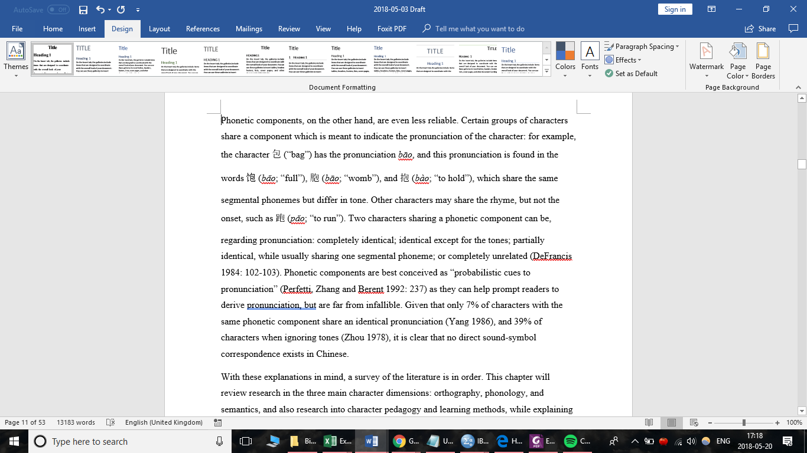

# Writing a paper in MS Word: resources

## Tutorials

- [David Button's Tips and Tricks (v.TM2003)](https://indico.jacow.org/event/65/contributions/3150/attachments/345/1311/TipNTricks%20-%20Word2023.pdf)

## Typesetting units

Numbers and units are typeset with an **unbreakable space** between them: use the shortcut `CTRL + SHIFT + space` to make a space that won't break at the end of the line.

**The numerical value always precedes the unit**, and a space is always used to separate the unit from the number, e. g. `10.2 m` (not `10.2m`).

The same [*should*](https://en.wikipedia.org/wiki/Degree_symbol#Typography) be done with temperature degrees: `30.2 °C` (not `30.2°C` or `30.2° C`).

The only **exceptions** to this rule are for the unit symbols for [**degree, minute, and second for plane angle**](https://en.wikipedia.org/wiki/Degree_symbol#Typography) (`°`, `'`, and `"`, respectively), for which no space is left between the numerical value and the unit symbol.

## Fix equations gone havoc

Ever encountered something like this?


You obviously encountered a Word document which used an **outdated version of the Equation Editor**, which is not supported anymore. To fix this mess double click on the equation and convert it to Office Math ML format as suggested by the floating window:


## How to solve the 'Asian Line Spacing' problem



The eastern versions of Word have a special option `Format` &rarr; `Paragraph`
 &rarr; `Snap to grid`. This option does not exist in the western versions. If 'Snap to grid' is checked, this results in large line spacing.

### If you have access to an Asian Word version

Deselect the option `Format` → `Paragraph` → `Snap to grid`.

### If you only have access to a western Word version

1. Open the Word document

2. `Alt + F11` to access the macro editor.

3. `Ctrl + G` to open the `immediate command` window

4. Paste the following command into it: 
   `ActiveDocument.Styles("Normal").ParagraphFormat.DisableLineHeightGrid = True`

5. If this only solves a part of the document, you have to create a macro that runs the command on the whole document: 

```visual-basic
   Sub disableLineHeightGrid()
     Dim aSty As Style, aPara As Paragraph
     For Each aSty In ActiveDocument.Styles
       If aSty.Type = wdStyleTypeParagraph Then
         aSty.ParagraphFormat.DisableLineHeightGrid = True
       End If
     Next aSty
     For Each aPara In ActiveDocument.Paragraphs
       aPara.Format.DisableLineHeightGrid = True
     Next aPara
    End Sub
```

### References

- [~~Windows Secrets Forum: Line spacing problem~~](https://windowssecrets.com/forums/showthread.php/129287-Line-spacing-problem) *(website non responsive at the time of writing)*
- https://www.edanz.com/resources/word-processing-tips-and-tricks-manuscript-appearance-snap-grid


