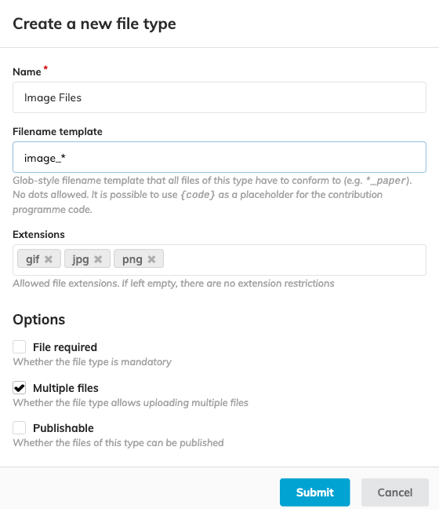
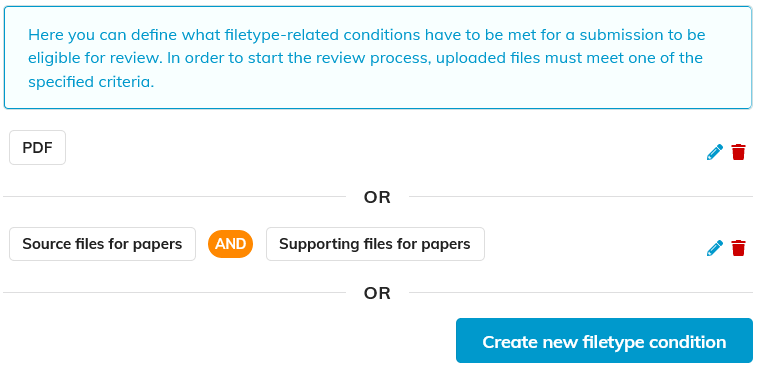

# Activating the Right Editing Workflows

An editing workflow can be applied to three different types of documents in Indico:

- Paper
- Slides
- Poster

JACoW conferences with the aim to publish proceedings will normally always use  the Paper editing workflow. Depending on your conference you may also want to activate one or several of the others. The alternative for collecting other files without passing them through a review process, is  to use the standard Indico `Material Submission` process.

In order to activate one or several editing workflows, go to the `Editing` module, then activate the toggle right of the `List of editable types`.

Activate the toggle right of each type for which you want to activate the editing workflow, then `Save`.

The display then switches back to the list of activated workflows.

Click on the **Manage** button of the desired editing workflow in order to configure it (see following sections).

## Configuring the File Types

One of the key instruments in ensuring the quality of submitted material in JACoW 
conferences is the possibility to limit users with regards to the type of files they submit and how they name them. This makes things more predictable so that further workflows (human and automated) can process the data accordingly and usually helps avoiding mistakes.

This is handled through **File Types** which can be seen as folders into which submitters upload their editable files.

Specific File Types can be set for each editing process (so independently for papers, slides and posters).

In order to configure your File Types for a given editing process, click on the Configure button in the File types section.

You can then add new File Types, edit or delete existing ones.

For each File Type, the following fields can be configured:

- **Name** - which will be displayed on the interface;
- **File name template** - the format which the name of the file to be uploaded should follow; this will be enforced when the user will submit the editable files; the 
  template can include the {code} placeholder which will be replaced by the contribution programme code
- **Extensions** - allowed file extensions for that file type;
- **File required** - whether the file type is mandatory (at least one file required);
- **Multiple files** - whether the file type allows for more than one file;
- **Publishable** - whether the contents of the type should be displayed publicly once the editable is published.

---

A standard JACoW conference will usually implement the following File Types:

- For **Papers**:
  
    - PDF
      
        - Extensions: `pdf`
      
        - Filename template: `{code}`
      
        - [x] Required
      
        - [x] Publishable
          
          **Important note**: for the purpose of creating the proceedings with [CAT](https://github.com/JACoW-org/CAT), the final file type to be published **must** be named `PDF`. Please do not change its name in these Indico settings.
  
    - Source Files
      
        - Extensions: `tex`, `doc`, `docx`, `odt`
      
        - Filename template: `{code}`
      
        - [x] Multiple
  
    - Supporting files
      
        - No extensions restriction
      
        - Filename template: `{code}_*`
      
        - [x] Multiple

- For **Slides**:
  
    - **PDF**
      
        - Extensions: `pdf`
      
        - Filename template: `{code}_slides`
      
        - [x] Required
      
        - [x] Publishable
          
          **Important note**: for the purpose of creating the proceedings with [CAT](https://github.com/JACoW-org/CAT), the final file type to be published **must** be named `PDF`. Please do not change its name in these Indico settings.
  
    - Source Files
      
        - Extensions: `ppt`, `pptx`, `tex`,`odp`, `keynote`
      
        - Filename template: `{code}_slides`
      
        - [x] Multiple

- For **Posters**:
  
    - PDF
      
        - Extensions: `pdf`
      
        - Filename template: `{code}_poster`
      
        - [x] Required
      
        - [x] Publishable
          
          **Important note**: [CAT](https://github.com/JACoW-org/CAT), the tool to create the final proceedings, currently does not consider Posters for publication.
  
    - Source Files
      
        - Extensions: `ppt`, `pptx`, `ai`, `odp`, `tex`
      
        - Filename template: `{code}_poster`
      
        - [x] Multiple

- For **Papers**:
  
    - PDF
      
        - Extensions: `pdf`
      
        - Filename template: `{code}`
      
        - [x] Required
      
        - [x] Publishable
          
          **Important note**: for the purpose of creating the proceedings with CAT, the final files to be published **must** be named `PDF`. Please do not change its name in these Indico settings.
  
    - Source Files
      
        - Extensions: `tex`, `doc`, `docx`, `odt`
      
        - Filename template: `{code}`
      
        - [x] Multiple
  
    - Supporting files
      
        - No extensions restriction
      
        - Filename template: `{code}_*`
      
        - [x] Multiple

- For **Slides**:
  
    - **PDF**
      
        - Extensions: `pdf`
      
        - Filename template: `{code}_slides`
      
        - [x] Required
      
        - [x] Publishable
          
          **Important note**: for the purpose of creating the proceedings with CAT, the final file type to be published **must** be named `PDF`. Please do not change its name in these Indico settings.
      
        - [ ] 
  
    - Source Files
      
        - Extensions: `ppt`, `pptx`, `tex`,`odp`, `keynote`
      
        - Filename template: `{code}_slides`
      
        - [x] Multiple

- For **Posters**:
  
    - PDF
      
        - Extensions: `pdf`
      
        - Filename template: `{code}_poster`
      
        - [x] Required
      
        - [x] Publishable
  
    - Source Files
      
        - Extensions: `ppt`, `pptx`, `ai`, `odp`, `tex`
      
        - Filename template: `{code}_poster`
      
        - [x] Multiple

- For **Papers**:
  
    - PDF
      
        - Extensions: `pdf`
      
        - Filename template: `{code}`
      
        - [x] Required
      
        - [x] Publishable
          
          **Important note**: for the purpose of creating the proceedings with CAT, the final files to be published **must** be named `PDF`. Please do not change its name in these Indico settings.
  
    - Source Files
      
        - Extensions: `tex`, `doc`, `docx`, `odt`
      
        - Filename template: `{code}`
      
        - [x] Multiple
  
    - Supporting files
      
        - No extensions restriction
      
        - Filename template: `{code}_*`
      
        - [x] Multiple

- For **Slides**:
  
    - **PDF**
      
        - Extensions: `pdf`
      
        - Filename template: `{code}_slides`
      
        - [x] Required
      
        - [x] Publishable
          
          **Important note**: for the purpose of creating the proceedings with CAT, the final file type to be published **must** be named `PDF`. Please do not change its name in these Indico settings.
      
        - [ ] 
  
    - Source Files
      
        - Extensions: `ppt`, `pptx`, `tex`,`odp`, `keynote`
      
        - Filename template: `{code}_slides`
      
        - [x] Multiple

- For **Posters**:
  
    - PDF
      
        - Extensions: `pdf`
      
        - Filename template: `{code}_poster`
      
        - [x] Required
      
        - [x] Publishable
  
    - Source Files
      
        - Extensions: `ppt`, `pptx`, `ai`, `odp`, `tex`
      
        - Filename template: `{code}_poster`
      
        - [x] Multiple

---

**Beware:** If you use `{code}` in your file name template, make sure programme codes are assigned to all contributions before you open up the files submission.

---

## Configuring the Ready for review Conditions

This is where you define minimum requirements an editable has to fulfil in order to 
be considered ready for editing. You can define conditions based on the 
type of the received files, combined with AND and OR operators.

In  order to configure your Ready for review conditions for a given editing  process, click on the Configure button in the Ready for review conditions section.

Then add the appropriate File Type conditions.

