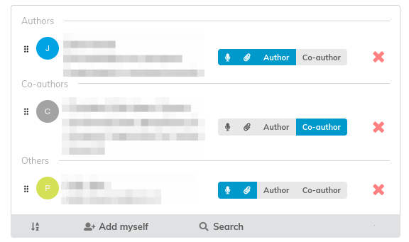

# Opening the Submission

Files can be submitted by Authors only when the submission of files is open.

It can be closed at any time by clicking the “close now” button.

# Requesting the authors for a metadata check

It is important to understand that a contribution usually changes a lot from the time of abstract submission to when one of the authors actually submits the paper. For example, experiments may have evolved and changed during this period, so a contribuiton could even result in something completely different from the original idea. Which means that it could also pertain to a different classificatoin!

While such dramatic cases are rare, most of the time the title of a contribution, its abstract, the list of authors can change in the paper. This introduces a metadata problem. Metadata is the paper's data in the contribution, which should be consistent with that in the actual paper (PDF) submitted for editing. 

The proceedings office usually make checks to spot all the cases of metadata consistency, but this process and the corrections that may be needed in the contribution are frequently very demanding in time (think of reviewing and correcting a list of 50 authors with their affiliation...) or even impossible (e.g., the paper reports an author named "*J. Lee, Their Institute*", but the Central Repositories does not have any suitable candidate - no editor will be able to get the complete name, email address etc. to create a new profile )

It is then the authors' responsibility to be sure the data is consistend. For this reason it is very important to delegate this task to the authors (paper submitters), which will mean... reminders!

## Emails to the submitters

The Scientific Secretariat (or the Editor-in-Chief) will use the contribution module in Indico and send several emails to the submitters before and during paper submission, reminding to:

- enter their "My contributions" area in Indico

- edit every contribution they are submitters of

- **check the contribution title** and, if different from the one in the paper, correct it in Indico. The title also needs to be written in [Sentence case](https://writer.com/blog/sentence-case/) (no Title Case, no ALL UPPERCASE...)

- **check the list of authors** and, if different from the one in the paper, correct it in Indico
  
    - in particular, be sure that only **one** author is present in the "Authors" section in Indico - this will be the **first author** as per IPAC tradition
  
    - all the other authors are present as **co-authors**. Entries outside these two sections (i.e., listed under "Others") won't be listed in the proceedings
  
    - **only one presenter is selected** and this corresponds with the person that will actually present the talk or poster at the conference
  
    - the **affiliations match with the one in the paper**. If not, the author needs to update their profile in the Central Repository before being added to any list of authors for papers

**Note**: the order of the co-authors is not important, it will be reordered by the module responsible for the creation of the final proceedings.

### Example of a wrong authors list

Can you spot how many problems are present in this example?

1. There are two presenters (*mic icon*), the first and last persons

2. An author is present in the "Others" section - they won't appear in the proceedings!

3. The fact that two people are marked as submitter (*paper clip*) is not a problem but should be discourage to avoid multiple people playing with the abstract

### When it should be allowed to have a person listed under "Others"

In very rare and exceptional cases (like, for example, the presenter fell ill or lost a flight) the SPC chair can allow a non-author to present a contribution (poster). Only in these cases the presenter should not be listed as author in the proceedings - hence this person should be entered as "Other" in Indico, as in the bad example above.

# Starting the Editing

Editables can be assigned to editors only when the Editing is started.

Start the editing process by clicking on the Start now button.

You can then close it at any time by clicking on the “Close now” button.

