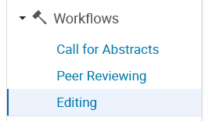
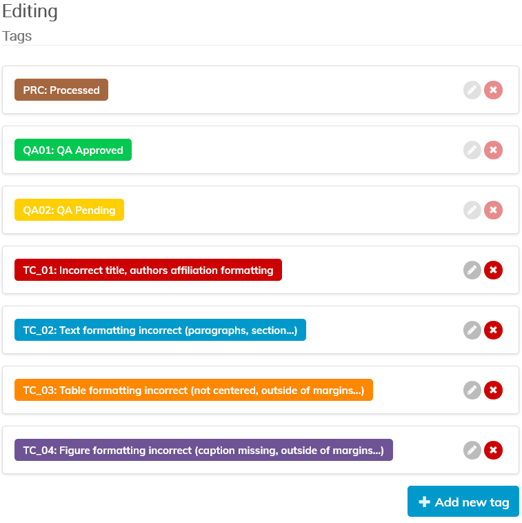
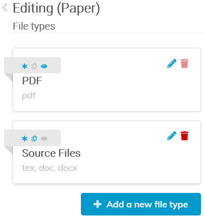
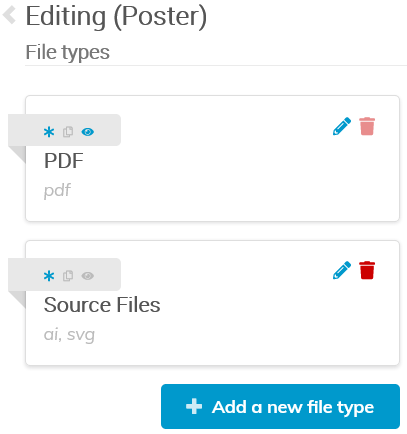

# Setting up the Editing Workflow

## Activating the Editing Module

While in the edit mode of your Indico conference, click on the `Editing` menu item in the left-hand-side menu under the `Workflows` section.

Then click on the `Enable module` button

## Activating the JACoW Editing Microservice

Your conference needs to be connected with the special JACoW Editing Microservice in 
order to automatically get JACoW-specific features that Indico does not provide by default.

In order to activate the JACoW Editing Microservice:

Go to the Editing module, then click on `Connect` in the `Custom editing workflow` section

Then paste `https://test-openreferee-jacow.web.cern.ch/` in the `Service URL` field and press `Connect`:

Here is a description of each special feature activated by this micro-service:

### Automatic creation of standard JACoW editing tags:

The first 3 tags (PRC, QA01 and QA02) are created as system tags: they cannot be modified or deleted, and cannot be assigned by editors to papers. They are automatically assigned by Indico to represent the state of an editable:  

- PRC: When a paper has been distilled  
- QA02: When a paper has been accepted  
- QA01: When a paper has been accepted and passed the final QA

The TC tags are tags representing error codes. They can be assigned to a paper by the editor.

### Automatic creation of standard JACoW file types:

### Introduction of the final QA state

This is a specificity of the JACoW editing workflow: Once accepted by 
the editor, the papers must go through a final QA process described in 
the [Publishing section](publish.md).
