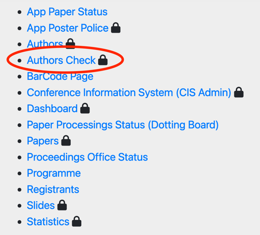
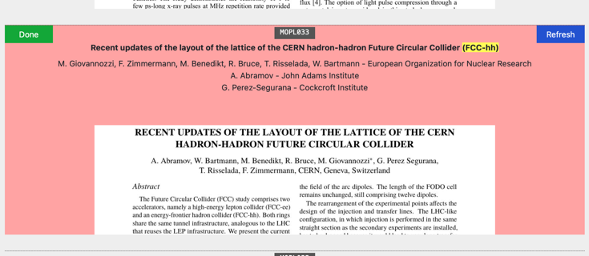
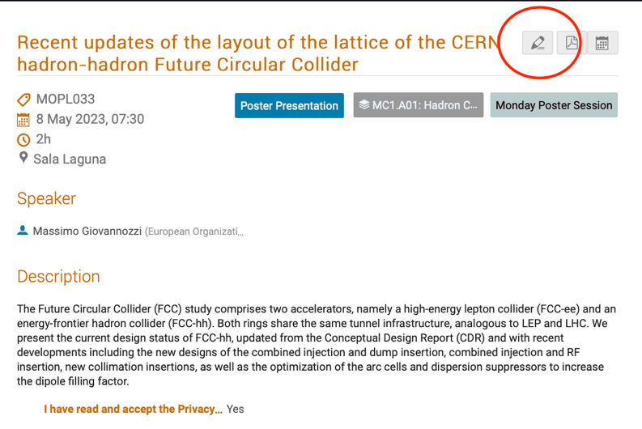
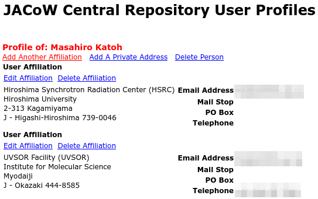
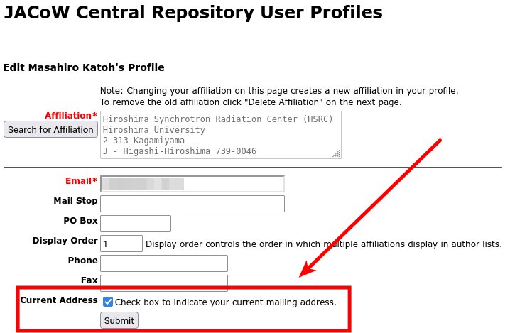
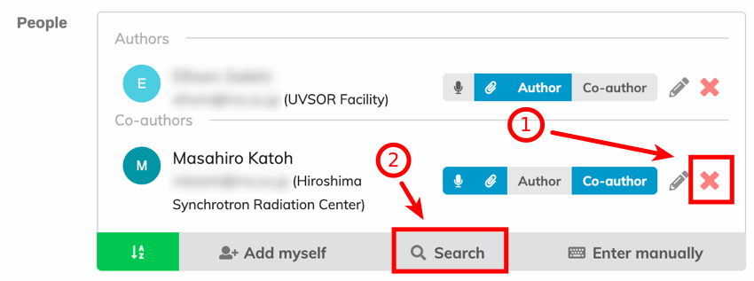
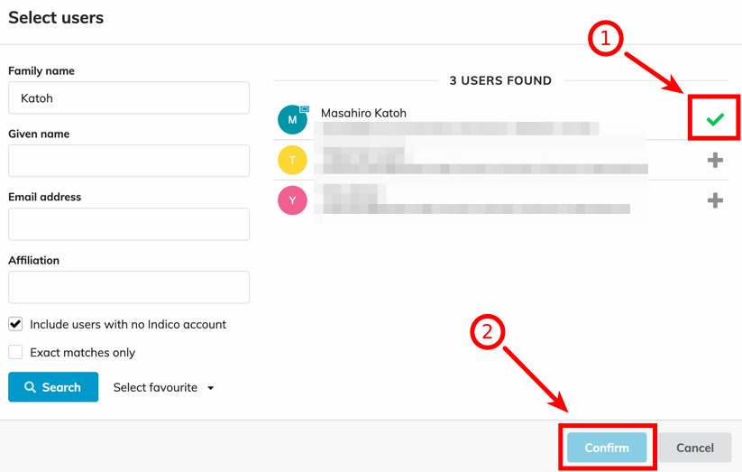
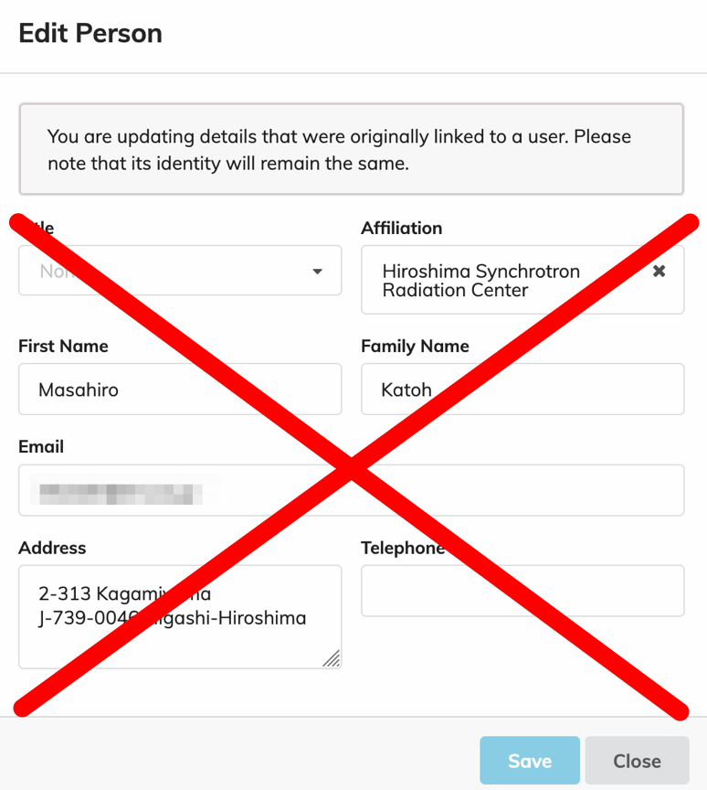

# Author Reception Desk

Every IPAC Proceedings Office usually includes an *Author Reception Desk*: 3/4 people provide a first interface to the authors that may have questions about their paper status. 

In addition to this fundamental role, the Author Reception Desk usually perform the **final metadata check between Indico and the submitted papers** after they have passed QA.

In fact, the proceedings will be created with the edited and QA'd paper PDFs, plus the information stored in Indico. All the indexes of the proceedings web pages and PDF metadata will be sourced from Indico. For this reason, it is of utter importance that titles and authors list in Indico correspond to those on the paper PDF.

Comparing information stored in Indico with what is present in a paper PDF is not easy nor straightforward. The [JACoW Indico Conference Toolbox](https://github.com/JACoW-org/JICT) however includes an **Authors Check Utility** that presents the the data in Indico on top of the data written in the PDF. JICT can also try and highlight differences in titles.

The process described in this page will use JICT's utility. Please note that JICT is not part of Indico and must be installed on a dedicated server. Refer to the JICT website for more information.

## Metadata check process

- Take a printed paper ready for Title/Author check

- Using the JICT Authors Check Utility:
  
    - Compare the Title and the Author list to the paper
  
    - Compare  the print copy of the paper’s author list and title to the Indico
       listing

- If necessary, update the contribution in Indico to reflect what's in the paper

***Note**: The title and the listing of authors/affiliations on the paper must
match the data in the Indico fields (apart from case format, read below).*

## Edit a contribution

### Title

The title of the paper must:

- have the same wording both in paper and Indico

- be all UPPERCASE in the paper (apart from acronyms or units) - if in doubt, ask the Editor-in-Chief

- be [Sentence case](https://writer.com/blog/sentence-case/) in Indico

If any of these conditions are not respected, go and modify the title in Indico. What's in the paper rules.

**Hint**: use the [titlecaseconverter.com](https://titlecaseconverter.com) utility to avoid typos

To **edit a contribution in Indico** click on the paper programme code in the JICT Author Check Utility (***MOPL033*** in the screenshot above), then on the pencil icon in Indico.

Then edit the title according to the rules above and click on the save button.

Back to the JICT Author Check Utility, click on the blue **Refresh** button to reflect the changes you made and perform another automatic check.

### Authors list

The authors list of a paper, according to the JACoW standards, is made of:

- first author to appear on the paper is the main/primary author

- all other authors are considered co-authors

- the order on the paper should be [grouped by affiliation and then alphabetically](https://www.jacow.org/Editors/CommonAuthorOversights), with [some exceptions](../../../Paper/Writing/general/ ).

We don't care about any order in the Indico metadata, because the [Conference Assembly Tool](../../../Proceedings/intro/) will take care of this. However, it's important to correctly identify the primary author vs co-authors. 

For the above reasons, it's important to:

- check that the first author on paper is the (only) author in Indico's "*Authors*" area

- check that all other authors on paper are present in Indico in the "*Co-authors*" area

- if possible, check that authors in Indico as the correct affiliation as stated on the paper.

However, it is possible that an author present on the paper is not findable in Indico. In cases like this, first try and search with different spellings of the name. If even this won't succeed, it may indicate that this author has no profile in the JACoW Central Repository. The only way to solve this is **asking the primary author of the paper** to [add a profile for this missing author in the Central Repository and then add them in the contribution's authors list](/General/submission/#creating-jacow-profiles-for-new-authors).

### How to ask the author for a metadata update

To **contact the author**, access the **editing timeline of this contribution** and [leave a comment](../edit/#commenting) (be careful not to assign the paper to you, nor judge it). When a comment is input, the submitting author will receive an email with it. They will then be able to satisfy the requests and reply with other comments. The whole communication will be logged in the editing timeline, assuring no information gets lost in the process.

It is important to remember that it is responsibility of the submitting/primary author to guarantee the consistency of all information in their contributions, authors' list included. For this reason **they** should correct/complete the data themselves. If, for any reason, they fail to do it and you're not able to do it on their behalf, the contribution should be accepted as is.

## How to change an author's affiliation (Central Repository permissions needed)

The profile data of authors of contributions is fetched by Indico from the Central Repository. Any later change in the author profiles won't automatically change the information (usually, the affiliation) in any contribution metadata. This is per design and allows to "freeze" the information at the time of submission. If, for any reason, this information needs to be corrected, it is necessary to:

1. Correct the profile information in the Central Repository

2. Allow the synchronisation of Indico with the Central Repository

3. Update the contribution's metadata

### 1. Correct the profile information in the Central Repository

Data in the JACoW Central Repository can be changed only by the person owning the specific JACoW account or by the [JACoW Repository Manager](https://www.jacow.org/Main/Contacts).

The JACoW Central Repository can manage multiple affiliations for every profile. However, Indico currently uses only the main ("current") affiliation.

*Example of a profile with two affiliations/addresses*:

Indico will only show the first address of the two since it's marked as primary/current address:

For this reason it is necessary to set the "Current Address" flag to the affiliation you want to appear in Indico.

### 2. Allow the synchronisation of Indico with the Central Repository

Indico fetches profiles information from the Central Repository in three different ways:

1. whenever a person logs in Indico a profile synchronisation is performed. This means that, right after changing the current affiliation in the Central Repository, by logging in Indico the new affiliation will show in Indico's profile (but not in contributions, read below);

2. every hour Indico updates its profiles database from the Central Repository. Again, this won't change any information in contributions;

3. at every search for authors, Indico both looks in its internal profile database and in the Central Repository. For this reason it is possible to update one single contribution without waiting for a synchronisation (points 1 or 2 here above).

### 3. Update the contribution's metadata

First, edit the contribution and remove the author with the wrong affiliation:

Then **Search** again for the author and add them to the contribution. This time the affiliation should be updated from the Central Repository:

For **NO REASON** you want to **manually edit the author's data in Indico** with the pencil tool, otherwise you could break the consistency of the indexes in the proceedings:

**Note**: this procedure will work not only for the affiliation but also for other data (like, but not limited to, fixing typos or glitches in the author's name).

## Bulk data synchronisation

Indico has a function to update all authors data in all contributions with just one click.

After having performed steps 1 and 2 of the previous section, access the admin console of the event and to to the "**Participant Roles**" page.

Now, look for the person you updated the data for in the Central Repository. If Indico was able to synchronise its profiles database already, you will spot a "double arrow" at the far right end of the person's line:

Click on that small icon. Indico will synchronise its "event person" data with what in this person's profile.

**Note**: for some reasons it may happen that some information in some contributions is not updated automatically. Be sure to check this person's contributions for the correct data. If needed, proceed with a [manual update of this contribution](#3-update-the-contributions-metadata).
