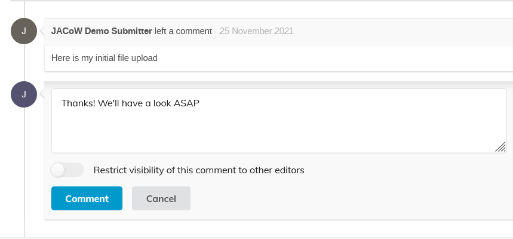
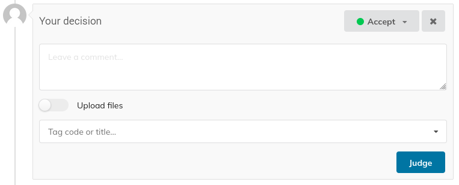
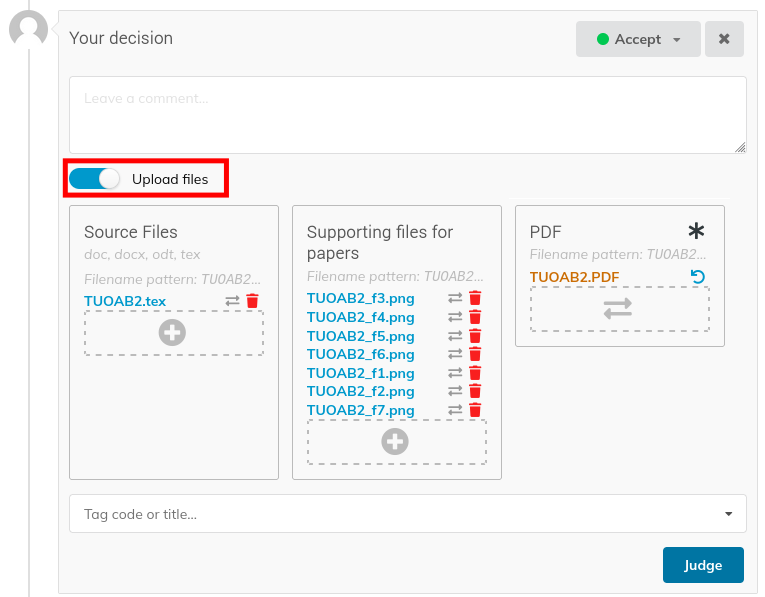
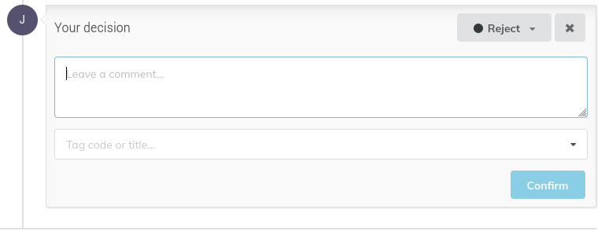
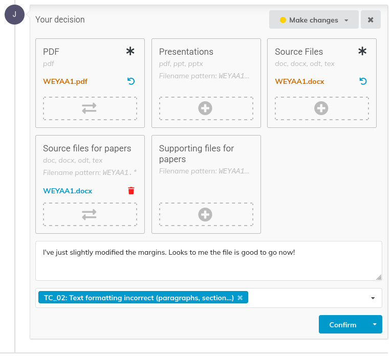
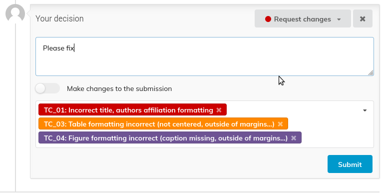

# Editing a document

Clicking on the title of the editable opens up its editing timeline. 
Revisions are represented in different boxes and actions can be performed on the spot with little menu-diving.

The top part of the page shows the contribution title, its numerical ID (e.g. *#73*), its programme code (*MOOB3*), status, submitter and assigned editor.

The first box on top always shows the **latest** revision of the files (in this example it's just a duplication of revision #1 below).

Then the boxes underneath show **all the actions and comments** made during the editing process **by chronological order**. Every action creates a new revision in the timeline.

## Commenting

<video style="width:576" controls="" alt="type:video">
   <source src="../Videos/003-Comments.mp4" type="video/mp4">
Your browser does not support the video tag.
</video>

Comments can be added by **any of the editors** set for the given editable type.

The visibility of a comment can be restricted to **other editors only**. In this case the submitter will not see it in their own timeline.

## Judging

Judging is the way an editor assesses an editable according to the [Editing States](/Paper/intro/#EditingStates), in paricular **Accept** (it's OK, <code style="color: green">green dot</code>), **Request approval** (the editor made changes which need acceptance, <code style="color: gold">yellow dot</code>)  or **Request changes** (to the author, <code style="color: red">red dot</code>). 

Only  the editor assigned to the editable can assign a judgment. It is accessible at the bottom of the timeline, through the Judge button, which gives access to 4 options:

(*Reject* is normally NOT used in JACoW conferences)

### Accept (<code style="color: green">GREEN</code>)

<video style="width:576" controls="" alt="type:video">
   <source src="../Videos/004-GreenDot.mp4" type="video/mp4">
Your browser does not support the video tag.
</video>

Choose  this option when the editable is ready for publishing. This will move 
the editable to the "Accepted" status, and notify the author by email. 

If you need to **upload a slightly revised version of the file** (e.g., you just *cropped* it to the JACoW papers size) **toggle the "Upload files" control**, load the new file(s) and then click on the "Judge" button.

This is nearly the end of the editing process (the editable needs to pass a final QA process before being fully publishable)

### Reject (<code style="color: black">BLACK</code>)

Choose  this option when the editable is simply rejected for publishing. It 
will move the editable to the Rejected status and notify the author by 
email. **JACoW conferences normally do not use to reject any paper**. Instead, the contibution can be withdrawn.

The Editor in Chief, however, could use this special state for specific reasons.

### Request Approval (<code style="color: gold">YELLOW</code>)

<video style="width:576" controls="" alt="type:video">
   <source src="../Videos/005-YellowDot.mp4" type="video/mp4">
Your browser does not support the video tag.
</video>

Choose this option when you have made some changes to the editable files yourself. You can upload the new files in the dialog which opens up. The  new revision will then be notified to the author by email for validation. Beware you must also submit a comment and, eventually, some tags (error codes,) or the "Confirm" button will not be activated.

If the author **rejects** your changes, they will be invited to upload a new version themselves, and you will be notified by email.

If the author **accepts** your changes, then the editable status moves to "Accepted" and this is nearly the end of the editing process (the editable needs to pass a final QA process before being fully publishable).

In both cases, you are **warned by email**. 

### Request changes (<code style="color: red">RED</code>)

<video style="width:576" controls="" alt="type:video">
   <source src="../Videos/007-RedDot.mp4" type="video/mp4">
Your browser does not support the video tag.
</video>

Choose this option when you want the authors to make some changes themselves. 
You can then explicit your request using the Comments field and the error tags list. The status of the editable then changes to "Needs changes", and an email is sent to the author.

It is often the case that only after having fixed a number of problems in a paper an editor realises that they cannot fix it completely and need to send it back to the author. In this case it is recommended that the author improves the files already been enhanced by the editor.

For this reason, when assigning a red dot, it is possible to upload the editor's files by activating the "**Make changes to the submission**" toggle:

Doing so you will be able to upload your updated files which can be downloaded by the author.

---

### Undo the last Action

You can always undo the last action you took on a paper by clicking the rounded arrow next to the status dot.

This will enable the editor to judge the editable again:

 

Please note that only the status is reverted. If any files have been uploaded, they are retained.
