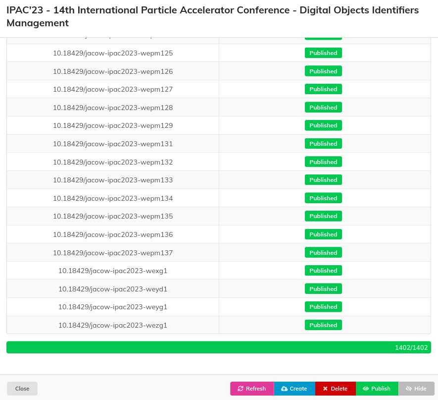

# Digital Object Identifiers (DOI)

Papers in the IPAC proceedings are given a unique [DOI](https://doi.org) built from the PURR settings and the paper's programme code:


The various bits of the DOI URL are set in the PURR configuration panel:


DOIs are registered by CAT via [Datacite](https://datacite.org/) by way of the DOI button in PURR's interface:


Datacite credentials are needed to actually register the DOIs. Contact the [JACoW Board of Directors](https://www.jacow.org/Main/Contacts) to get directions about these settings.

## Registering DOIs

When the final proceedings package has been created and sent to the JACoW EMEA Regional Support Centre Manager for publication, it's time to register the DOIs on doi.org.



Upon opening this window CAT queries Datacite.org and lists the papers status.

The left column lists the DOI codes created by CAT for all publishable papers. The syntax follows the parameters in the PURR settings.

The right column shows each DOI status on DOI.org via Datacite.org. In the screenshot above all DOIs are **published and searchable** on DOI.org.

---

**Note**: in case the final proceedings haven't been created yet or before registering the DOIs (with the **Create** action here below) the status shown is:

```
Not Found - The resource is not found. 
Check that final proceedings have been generated correctly.
```

---


The buttons at the bottom of this window trigger some actions:

- **Refresh**: forces a refresh of the list above by querying Datacite.org.

- **Create**: Registers the whole DOIs dataset via Datacite. By default the newly registered DOIs are hidden.

- **Delete**: De-registers the whole DOIs dataset. Only unpublished DOIs can be deleted. Once they're published, the can only be hidden.

- **Publish**: Makes the DOIs visible and searchable on doi.org.

- **Hide**: Makes published DOIs invisible and not searchable.

Note: 
