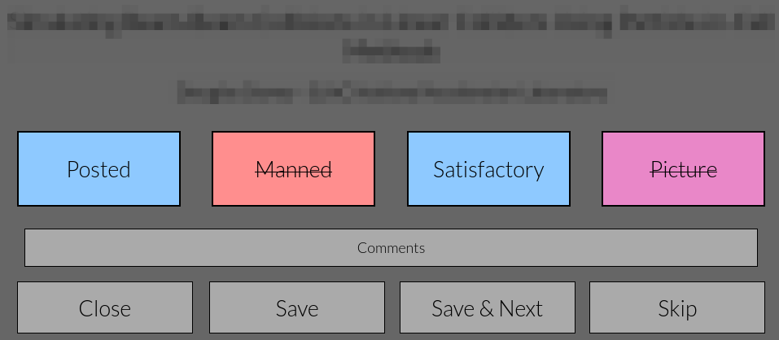
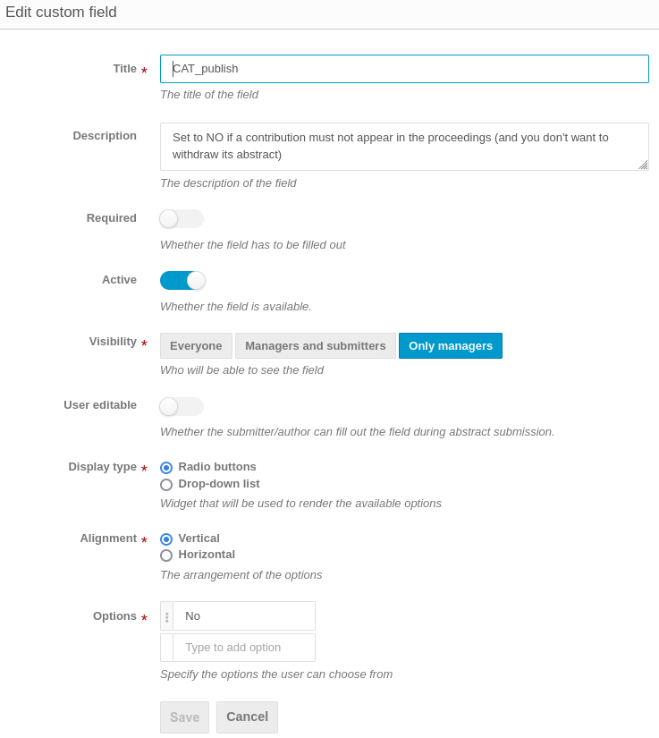

# Poster checks

IPAC has a strict policy on publishing papers of poster contributions. Their posters must be:

- **Posted**: a poster must be present on the poster board in the assigned poster session

- **Manned**: an author must be standing in front of the poster available for discussing its contents

- **Satisfactory**: the quality of the poster must be high enough for the contents to be read and understood by the attendees. An example of a non-satisfactory poster is a collage of small A4 printouts.

Papers that don't satisfy these three requirements cannot be published in the proceedings.

The organisers can decide to perform this kind of checks as they prefer. Indico has no functionality to support these checks. An external tool, connected to Indico, can however be used. 

The [JACoW Indico Conference Tools  (JICT)](https://github.com/JACoW-org/JICT) tool contains a web application that can be used on small screens like smartphones or tablets and collect the status of the Poster Quality Assurance Team during the poster sessions:

The same tool contain a report that allows to easily spot posters that did not pass the quality checks above.

Please refer to the JICT documentation for more details on these and other features.

## What if a poster does not pass these checks?

As stated above, the related paper must not be admitted into the proceedings. 

However, before excluding a contribution, contact the presenter and ask for any justification. In the example above, for example, the paper of contribution `TUPM112` has been accepted during editing but the poster, even if present and satisfactory, was found unmanned, i.e. no authors were found in front of it. The presenter can justify, for example, providing a photo of them in front of the poster. This must be dealt with usually via email.

If there is no justification for an unsatisfactory poster, its contribution must be excluded from the proceedings. 

The easiest way to do this could be to mark the paper as "rejected" ([black status](/Paper/intro)).

However, this will result in the abstract be included in the proceedings, without the paper. In cases like this we actually want to completely exclude a contribution from the proceedings, i.e. not even the title, authors list and abstract must be present.

To accomplish this goal it is possible to use a special custom field in contributions, normally called `CAT_publish`. This must be a [contributions custom field](/InitialSetup/mgmt_area_03/#abstract-fields) of type boolean (only the negative value is actually used):

Then, this field must be declared in [PURR's settings](https://purr-docs.jacow.org/Functionalities/statusAndSettings/) (*Final proceedings /Extra* panel):

At this point it is possible to edit the contribution's details and set this custom field to "No".
